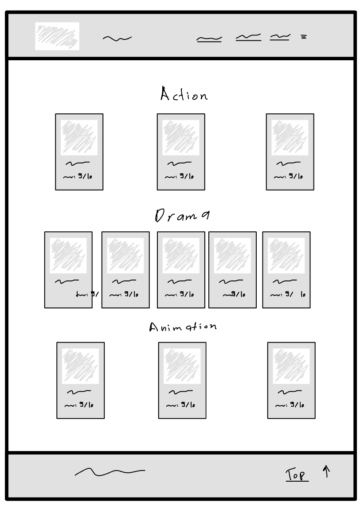

 

  <h1> الواجب الثاني 😍 </h1>
  <h3>في هذا الواجب ستقوم بصنع منصة لأفلامك المفضلة 📺!</h3>
 
1) قم بعمل fork للـ repository
2) افتح الـ repository باستخدام github desktop
3) أنشئ صفحة رئيسية للموقع
4) غير عنوان الصفحة و أيقونتها
5) غير عائلة الخط إلى خط يعجبك أو monospace
6) أنشئ شريط تنقل (header / navbar) في أعلى الصفحة: 
    - يحتوي على أيقونة المنصة وعنوانها في اليسار
        `مساعدة: ستسخدم وسم <a> ويجب أن تكون قيمة ال href تساوي id العنصر الذي تريد الذهاب إليه`
    - يحتوي على روابط تَنقل إلى تصنيفات الافلام في اليمين
7) استخدم وسم `<h1>` لكتابة الصنف الاول من اختيارك `مثال: الرعب`
8) أنشئ كرت يحتوي على:
    - صورة الفلم
    - عنوان الفلم
    - تقييم الفلم
      - ضع حدود وضلال للكروت (box-shadow & border)
      - قم بإضافة تحويلات عند تمرير المؤشر (transition) على كل الخصائص
 9) كرر خطوة 7 و8 للصنف الثاني والثالث
10) انشئ تذييل (footer)  الموقع يحتوي على:   
    - جملة `"Copyright © 2022 all rights reserved"`
    - زر ينقلك إلى أعلى الصفحة (button)
11) احفظ التغييرات وارفع الكود إلى github
12) قم بتسليم الواجب على موقع Coded lab

## بونص!🔥

* عند المرور علــى الكرت بالمؤشر ينقلب الكرت (Flip) لظهور مكونات الوجبة
* عند الوقوف على الكرت يتغير شكل المؤشر 
* استخدم Linear gradient في موقعك
  - استخدم موقع <a href="https://cssgradient.io">CSS Gradient</a> لإنشاء الألوان الخاصة بك
* قم باعطاء Z-index لشريط التنقل  (ليظهر اعلى من العناصر الاخرى) 

استخدم موقع <a href="https://www.w3schools.com/">w3schools</a> للمزيد من المعلومات

